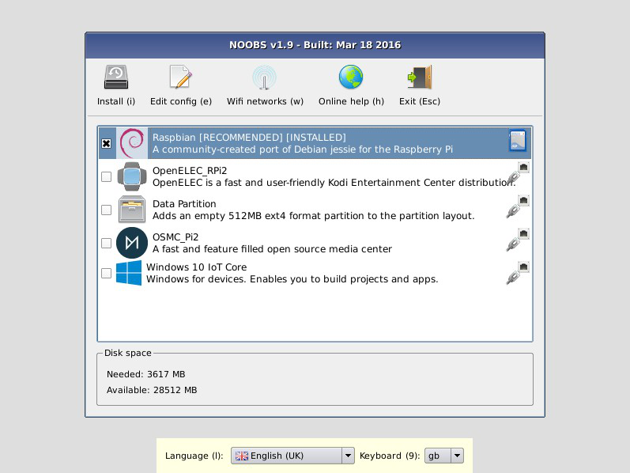
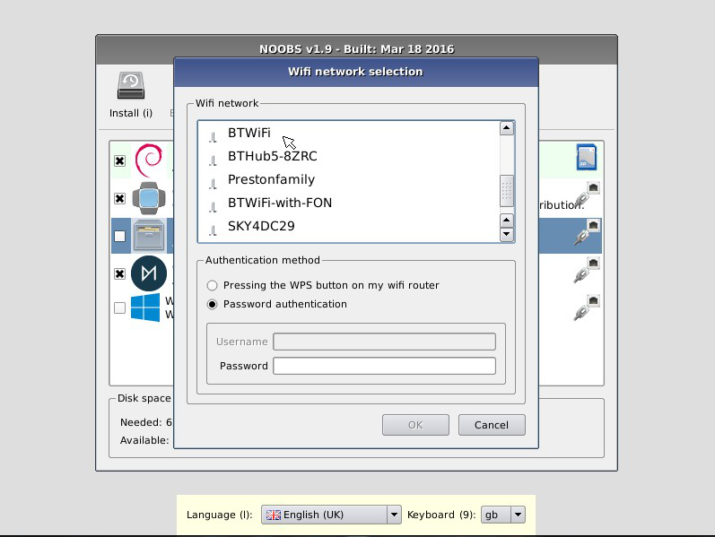

# NOOBS+ (New Out of Box Software Plus)
#### An easy Operating System installer for the Raspberry Pi
## Warning! NOOBS+ is still in beta!

NOOBS+ is designed to make it easy to select and install operating systems for the Raspberry Pi without having to worry about manually imaging your SD card.

*NOTE: The list of OSes in this image is indicative only. It will vary according to your Raspberry Pi model and the availability of OSes on our remote download repository.

### About
On first boot NOOBS+ will repartition your SD card and allow you to select which OSes you want to install from a list. This OS list is automatically generated from both locally available OSes (i.e. those contained in the `/os` directory on disk) or those available from our remote repository (network connection required).

Only the latest version of each OS will ever be displayed meaning that you can be sure that you have installed the most up-to-date release of your selected OS.

On any subsequent boot you can then press the SHIFT key to enter the NOOBS+ interface and easily reinstall your choice of OSes.

The NOOBS+ interface provides the following functionality:
- <b>Install</b>: Installs the selected OSes onto your SD card. Changing this selection erases all OSes currently installed.
- <b>Edit Config</b>: Opens a text editor allowing the cmdline and config for the selected installed OS to be edited.
- <b>Online Help</b>: [Networking Required] Open a browser that displays the Raspberry Pi Help page ( http://www.raspberrypi.org/help/ ), allowing people to quickly access help and troubleshooting.
- <b>Exit</b>: Quits NOOBS+ and reboots the Pi into the OS boot menu.
- <b>Language Selection</b>: Allows you to select the language to be displayed.
- <b>Keyboard Layout Selection</b>: Allows you to select the keyboard layout to be used.
- <b>Display Mode Selection</b>: By default, NOOBS will output over HDMI at your display's preferred resolution, even if no HDMI display is connected. If you do not see any output on your HDMI display or are using the composite output, press 1, 2, 3 or 4 on your keyboard to select HDMI preferred mode, HDMI safe mode, composite PAL mode or composite NTSC mode respectively.

Note that all user settings (language, keyboard layout, display mode) will persist between reboots and will also be automatically passed to the installed OSes. This means that if you can see the NOOBS+ interface on your display device then you should be able to see the OS CLI/GUI when it boots too!
### Setup

**Raspberry Pi 4 Model B:** display must be connected to HDMI port closest to power jack.

To set up a blank SD card with NOOBS+{:
- Format an SD card as FAT. See the instructions given below.
  - Your SD card will need to be at least 16GB for Full Raspberry Pi OS, or at least 8GB for all other installs.
  - Consider using NOOBS-Lite with an internet connection if you want to leave more space for operating systems.
- Download and extract the files from the NOOBS zip file. (Windows built-in zip features may have trouble with this file. If so, use another program such as [7zip](http://www.7-zip.org/).)
- Copy the extracted files onto the SD card that you just formatted so that these files are at the root directory of the SD card. Please note that in some cases it may extract the files into a folder; if this is the case, then please copy across the files from inside the folder rather than the folder itself.  

On first boot the "RECOVERY" FAT partition will be automatically resized to a minimum and a list of OSes that are available to install will be displayed.

### Operating System Choice

NOOBS is available in 2 formats:
- `NOOBS+ Full` includes the installation files for Raspberry Pi OS Full and LibreELEC only and is in Beta.
- `NOOBS+ Lite` does not include any Operating Systems at all and is still in alpha.

Please note that RISC OS cannot be installed by the NOOBS+ FULL version due to the amount of space taken up by the included Operating Systems.

If you want to install RISC OS, use NOOBS+ Lite instead, or change the included operating systems.

#### OS Network Download

Both versions of NOOBS+ allow additional Operating Systems to be downloaded from our remote repository. To do this, the Raspberry Pi must be connected to a wired network, or it can connect over Wifi using Raspberry Pi 3 and later's built-in wifi. 

Once connected, the Pi will only show a list of Operating Systems that are appropriate to your Pi Model. If you want to see ALL available OSes, edit the `recovery.cmdline` file in the root NOOBS directory and append `showall` to the arguments list.

#### Wifi Networks

If you are using the Raspberry Pi 3 or later with built-in wifi, the wifi icon on the NOOBS+ toolbar will be available. Click on this to select your Wifi SSID network and enter the wifi password. 

#### Wired Networks

If a wired ethernet cable is plugged into the Pi before NOOBS+ starts, NOOBS+ will connect via DHCP to Raspberry Pi's remote download repository and present a list of available Operating Systems that are available for installation.

### How to Format an SD card as FAT

For <b>Windows</b> users, we recommend formatting your SD card using the SD Association's Formatting Tool, which can be downloaded from https://www.sdcard.org/downloads/formatter_4/ You will need to set "FORMAT SIZE ADJUSTMENT" option to "ON" in the "Options" menu to ensure that the entire SD card volume is formatted - not just a single partition. With the latest SD Association Formatting Tool (V5.0) that option has been removed and is now the default. For more detailed and beginner-friendly formatting instructions, please refer to http://www.raspberrypi.org/quick-start-guide

The SD Association's Formatting Tool is also available for <b>Mac</b> users although the default OSX Disk Utility is also capable of formatting the entire disk (select the SD card volume and choose "Erase" with "MS-DOS" format).

For <b>Linux</b> users we recommend `gparted` (or the command line version `parted`). (Update: Norman Dunbar has written up the following formatting instructions for Linux users: http://qdosmsq.dunbar-it.co.uk/blog/2013/06/noobs-for-raspberry-pi/ )

===

### Legal compliance

Copyright (c) 2020, Raspberry Pi All rights reserved.

Redistribution and use in source and binary forms, with or without modification, are permitted provided that the following conditions are met:

Redistributions of source code must retain the above copyright notice, this list of conditions and the following disclaimer.
Neither the name of the Raspberry Pi Foundation nor the names of its contributors may be used to endorse or promote products derived from this software without specific prior written permission.
THIS SOFTWARE IS PROVIDED BY THE COPYRIGHT HOLDERS AND CONTRIBUTORS "AS IS" AND ANY EXPRESS OR IMPLIED WARRANTIES, INCLUDING, BUT NOT LIMITED TO, THE IMPLIED WARRANTIES OF MERCHANTABILITY AND FITNESS FOR A PARTICULAR PURPOSE ARE DISCLAIMED. IN NO EVENT SHALL THE COPYRIGHT HOLDER OR CONTRIBUTORS BE LIABLE FOR ANY DIRECT, INDIRECT, INCIDENTAL, SPECIAL, EXEMPLARY, OR CONSEQUENTIAL DAMAGES (INCLUDING, BUT NOT LIMITED TO, PROCUREMENT OF SUBSTITUTE GOODS OR SERVICES; LOSS OF USE, DATA, OR PROFITS; OR BUSINESS INTERRUPTION) HOWEVER CAUSED AND ON ANY THEORY OF LIABILITY, WHETHER IN CONTRACT, STRICT LIABILITY, OR TORT (INCLUDING NEGLIGENCE OR OTHERWISE) ARISING IN ANY WAY OUT OF THE USE OF THIS SOFTWARE, EVEN IF ADVISED OF THE POSSIBILITY OF SUCH DAMAGE.

#### Third party licenses:

Recovery software directly links to:
- Qt libraries, available under LGPL and commercial license.

Currently used icon sets:
- http://www.fatcow.com/free-icons - Creative commons Attribution license
- https://www.flaticon.com
- http://www.famfamfam.com/lab/icons/flags - "These flag icons are available for free use for any purpose with no requirement for attribution."
- http://www.oxygen-icons.org/ - Available under Creative Common Attribution-ShareAlike 3.0 and LGPL license

Licenses of utility software built by buildroot:
Type `cd buildroot ; make legal-info` to generate a list, which will be available under `output/legal-info`.
